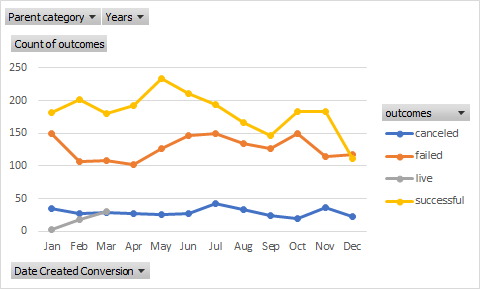

# Kickstarting with Excel

## Overview of Project

### Purpose
The purpose of this project is to analyze the kickstarter dataset to determine the outcomes of different funding campaigns in relation to their launch dates and funding goals. This will create two different analyses. 

## Analysis and Challenges

### Analysis of Outcomes Based on Launch Date
In order to create the analysis of Outcomes Based on Launch Date, a pivot table was created. This pivot table was filtered with the "Parent Category" set to "theater" and "Years" set to "(All)", and the table itself showed the number of canceled, failed, and successful outcomes for each month. The data of this table was then visualized using a pivot line chart. 

In viewing this line chart, it can be seen that theater kickstarters had the most number of successful outcomes when launched in May, and had the least number of successful outcomes in December. 

### Analysis of Outcomes Based on Goals
In order to create the analysis of Outcomes Based on Goals Chart, the COUNTIFS function was used to group projects based on their goal amount. This dataset was then visualized using a line chart. 
In viewing the line chart, it is seen that the lower goal amount ranges have more successful outcomes and less failed outcomes, and as the goal ranges go up, the number of failed to successful outcomes gets closer and closer until they equal each other and then the failed outcomes surpasses the successful outcomes (around the range 15000 to 19999). The most failed outcomes and least successful outcomes occurs in the range 45000 to 49999. Additionally, this price range also contains the most canceled outcomes. 

### Challenges and Difficulties Encountered
The main challenge or difficulty I encountered during this challenge was using the COUNTIFS() function to populate each column. I tried autofilling all the columns after filling one column out, but it messed up some of the cell references and I ended up getting the wrong results. I thought there must be some way to get the columns filled in without me directly typing in the formula each time, however I came across many difficulties and ended up getting frustrated. In the end, I ended up manually typing out most of the cell contents 

## Results

- What are two conclusions you can draw about the Outcomes based on Launch Date?
The first conclusion is that May would be the best month to begin a campaign. 
The second conclusion is that October and December would be the worst months of the year to begin campaigns, since october has the most failed campaigns, and december has the least amount of successful campaigns. 

- What can you conclude about the Outcomes based on Goals?
It is better to have a campaign goal in one of the lower price ranges, rather than the higher prices ranges.

- What are some limitations of this dataset?
The data cannot explain why some campaign has failed or succeeded, it can only show some useful correlations. However correlation does not equal causation, therefore there many other factors which may have caused some campaigns to be more successful than another based on factors other than the launch time or goal amount. 

- What are some other possible tables and/or graphs that we could create?
A pie chart (perhaps a pivot pie chart?) could be made to show the percentage failed, successful, or cancelled campaigns. Which can then be filtered by month, year, or even price range. 
 